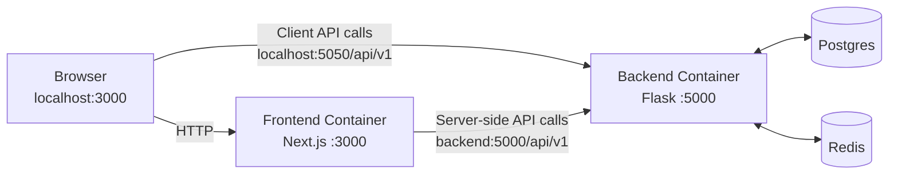
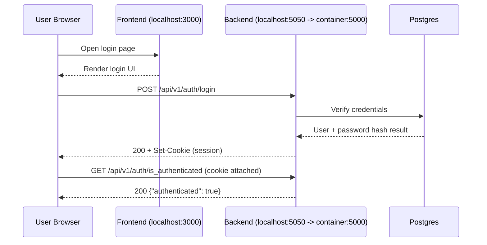

# Architecture

## Monorepo Layout
- `frontend/`: Next.js app (UI, client/server API execution)
- `backend/`: Flask API (auth, feed/content APIs, seed scripts)
- `mobile/`: Flutter app (optional for the core demo)
- Root `docker-compose.yml` + `Makefile`: local orchestration

## Local Demo Topology

Port semantics:
- `localhost:5050` is the host port mapped to backend container port `5000`.
- `backend:5000` is reachable only from other containers on the compose network.
- Browsers use `localhost` endpoints, not compose service DNS names.

## Why Two API Base URLs Exist
- `NEXT_PUBLIC_API_BASE_URL`:
  - Used by browser-executed code.
  - Must resolve from the host machine/browser, so local demo uses `http://localhost:5050/api/v1`.
- `INTERNAL_API_BASE_URL`:
  - Used by server-side Next.js execution inside the frontend container.
  - Resolves over Docker DNS, so local demo uses `http://backend:5000/api/v1`.

This split prevents browser networking failures while keeping server-side calls inside the Docker network.

## Login Flow (Session Cookie)

## Service Responsibilities
- Frontend:
  - Renders UI and navigation.
  - Executes both browser and server-side API calls using environment-specific base URLs.
- Backend:
  - Handles auth/session and feed/content endpoints.
  - Persists relational data and uses Redis-backed async plumbing where configured.
- Postgres:
  - Primary application database.
- Redis:
  - Broker/cache support for async and near-realtime workloads.

## Demo Reliability
- Single-command startup: `make demo`
- Deterministic seed data: `make seed`
- Scripted smoke checks: `make smoke`

## Configuration Model
- Root defaults: [`.env.example`](../.env.example)
- Backend defaults: [`../backend/.env.example`](../backend/.env.example)
- Frontend defaults: [`../frontend/.env.example`](../frontend/.env.example)
- Secrets policy: [`../SECURITY.md`](../SECURITY.md)

## Optional Mobile Track
`mobile/` stays intentionally optional and is not required for the web/API portfolio demo.

## Related Docs
- Quickstart: [`../README.md`](../README.md)
- Demo script: [`DEMO.md`](DEMO.md)
